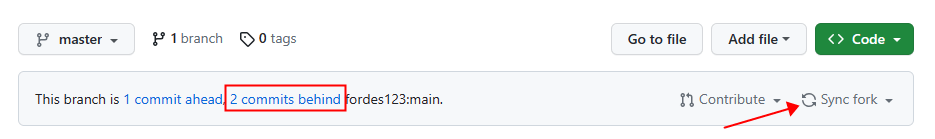

<div align="center">
<h1>AD Filter Subscriber</h1>
  <p>
    广告过滤规则订阅器，整合不同来源的规则，帮助你快速构建属于自己的规则集~
  </p>
<!-- Badges -->
<p>
  <a href="https://github.com/fordes123/ad-filters-subscriber">
    
  </a>
  <a href="https://github.com/fordes123/ad-filters-subscriber">
    
  </a>
  <a href="https://github.com/fordes123/ad-filters-subscriber">
    
  </a>
  <a href="https://github.com/fordes123/ad-filters-subscriber/issues/">
    
  </a>
  <a href="https://github.com/fordes123/ad-filters-subscriber">
    
  </a>
</p>

<h4>
    <a href="#a">项目说明</a>
  <span> · </span>
    <a href="#b">快速开始</a>
  <span> · </span>
    <a href="#c">规则订阅</a>
  <span> · </span>
    <a href="#d">问题反馈</a>
  </h4>
</div>

<br/>
<h2 id="a">📔 项目说明</h2>

本项目旨在整合不同来源的广告过滤规则，通过 `Github Action` 定时执行，拉取远程规则，去重和分类输出。
根据过滤规则的特性，本项目将规则分为 `DOMAIN`、`REGEX`、`MODIFY`、`HOSTS` 四种类型，它们之间互不包含， 你可在配置文件中自由的对四种类型进行组合：

- `DOMAIN`：基于域名的过滤规则，适用于几乎所有广告过滤工具
- `REGEX`：基于正则表达式的**域名过滤**规则，适用于主流广告过滤工具
- `MODIFY`：基于正则和其他修饰符的过滤规则，可以拦截页面上的特定元素，但不适用于DNS过滤
- `HOSTS`：基于 `HOSTS` 的过滤规则，适用于支持 `HOSTS` 的所有设备

<br/>
<h2 id="b">🛠️ 快速开始</h2>

### 示例配置

```yaml
application:
  rule:
    #远程规则订阅，仅支持http、https
    remote:
      # 配置格式1, 名称(name) + URL(path)
      - name: 规则名称
        path: 'https://example.com/list.txt'

      # 配置格式2, 匿名URL
      - 'https://example.com/list.txt'

    #本地规则，请将文件放入项目路径rule目录中，配置格式同上
    local:
      - name: private
        path: 'private.txt'

  output:
    file_header: |  #输出文件头, 占位符${name}将被替换为文件名, ${date} 将被替换为当前日期时间
      [ADFS Adblock List]
      ! Title: ${name}
      ! Last Modified: ${date}
      ! Homepage: https://github.com/fordes123/ad-filters-subscriber/
    path: rule   #规则文件输出路径，相对路径默认为程序所在路径
    files:
      all.txt: #输出文件名, 下列表为其包含的规则类型
        - DOMAIN  #域名规则，仅完整域名
        - REGEX   #正则规则，包含正则的域名规则，AdGH支持
        - MODIFY  #修饰规则，添加了一些修饰符号的规则，AdG支持
        - HOSTS   #Hosts规则
```

---
本程序基于 `Java17` 编写，使用 `Maven` 进行构建，你可以参照示例配置，编辑 `src/main/resources/application.yml`
，并通过以下任意一种方式快速开始：

#### **本地调试**

```bash
git clone https://github.com/fordes123/ad-filters-subscriber.git
cd ad-filters-subscriber
mvn clean
mvn spring-boot:run
```

#### **Github Action**

- fork 本项目
- 自定义规则订阅 (可选)
    - 参照示例配置，修改配置文件: `src/main/resources/application.yml`，注意本地规则文件应放入项目根目录 `rule` 文件夹
- 打开 `Github Action` 页面，选中左侧 `Update Filters` 授权 `Workflow` 定时执行(⚠ 重要步骤)
- 点击 `Run workflow` 或等待自动执行。执行完成后相应规则生成在配置中指定的目录下

#### **Codespaces**

- 登录 `Github`，点击本仓库右上角 `Code` 按钮，选择并创建新的 `Codespaces`
- 等待 `Codespaces` 启动，即可直接对本项目进行调试

### 如何更新

当源代码存在更新时，(你的)仓库首页会出现如下图提示:


此时选择 **Sync fork** 再选择 **Update branch** 即可同步更新.  
(如曾修改过源代码，那么合并可能存在冲突，请谨慎处理)

<br/>
<h2 id="c">🎯 规则订阅</h2>

**⚠ 本仓库不再提供规则订阅，我们更推荐 fork 本项目自行构建规则集.**

下面是使用了本项目进行构建的规则仓库，可在其中寻找合适的规则订阅:
<details>
<summary>点击查看</summary>
<ul>
    <li><a href="https://github.com/xndeye/adblock_list/">xndeye/adblock_list</a></li>
    <p>欢迎提交 issues 或 pr 留下你的仓库地址~</p>
</ul>
</details>

<br/>
<h2 id="d">💬 问题反馈</h2>

- 👉 [issues](https://github.com/fordes123/ad-filters-subscriber/issues)
